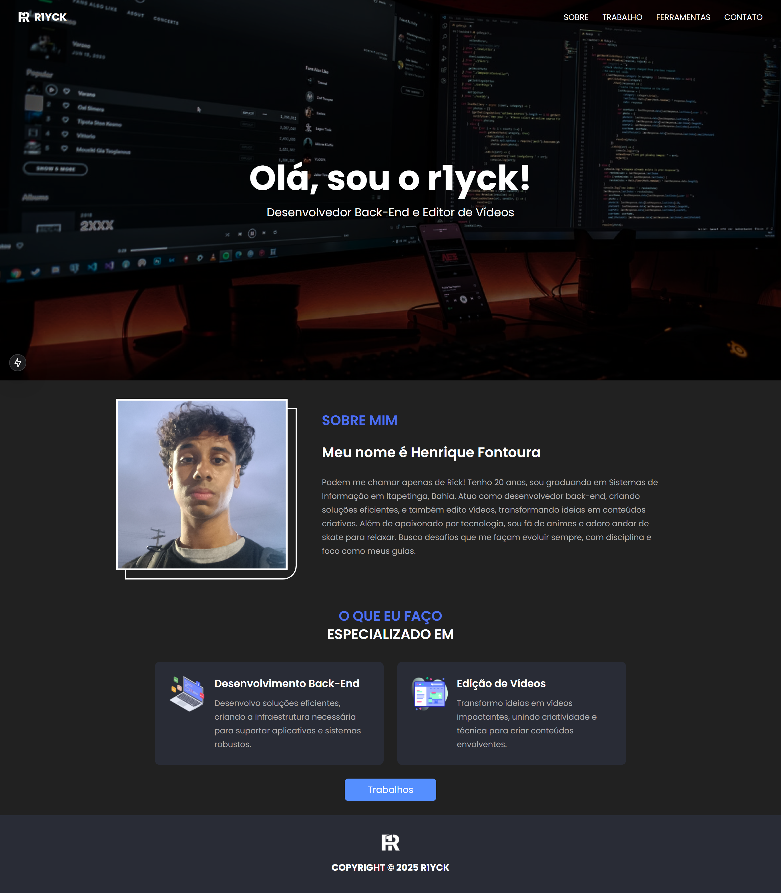
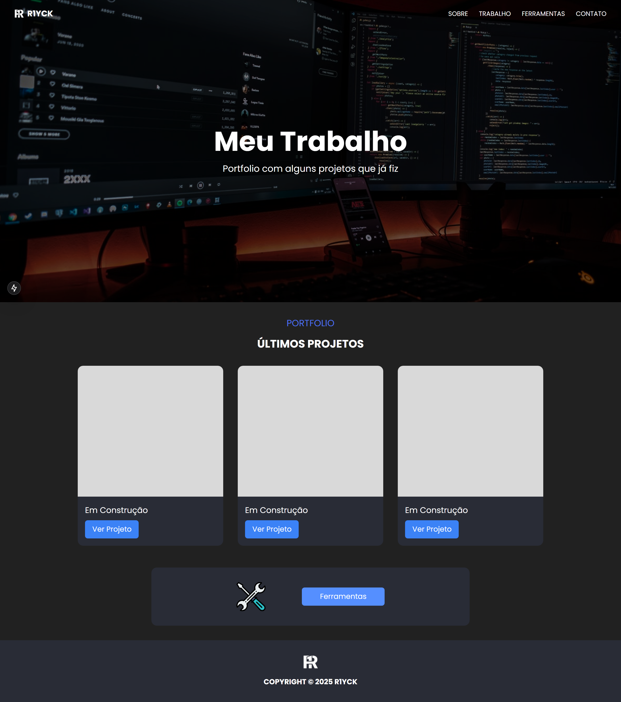
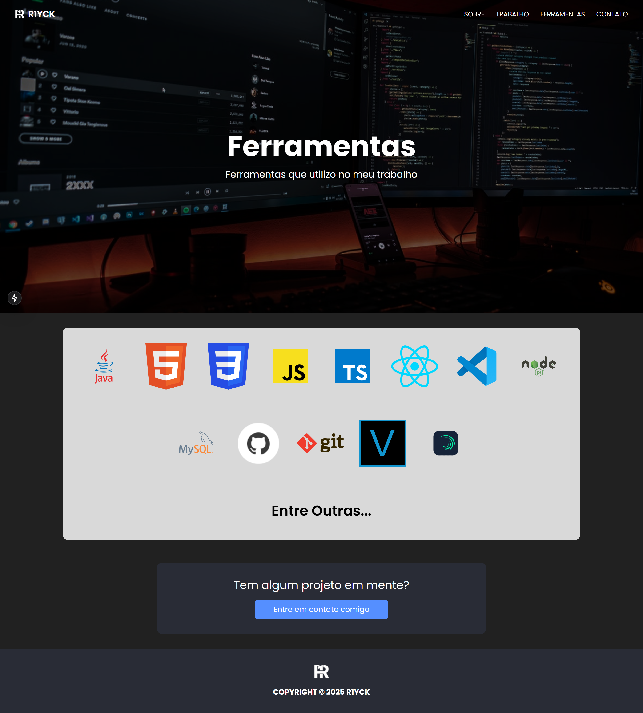
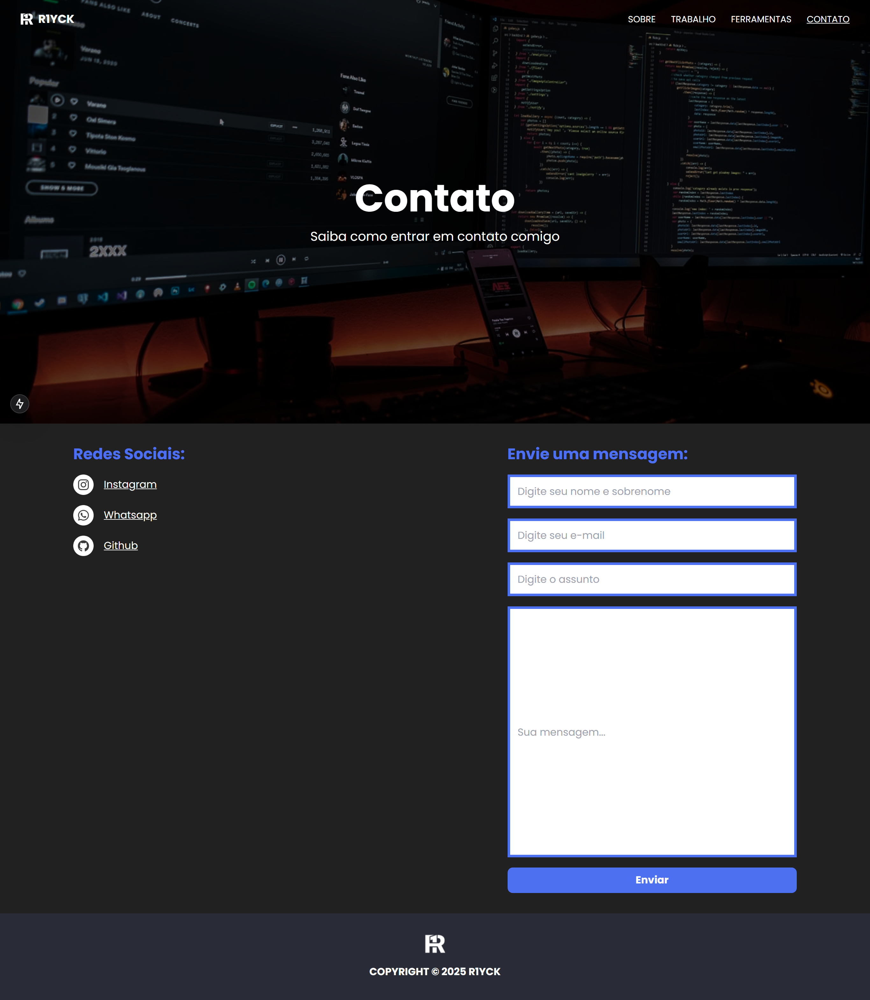

# Meu Portfólio

Bem-vindo ao meu portfólio! Este site foi desenvolvido com o objetivo de exibir minhas habilidades como desenvolvedor, apresentando alguns dos meus projetos e experiências.

Este projeto foi construído com o [Next.js](https://nextjs.org), utilizando as melhores práticas de desenvolvimento web. Abaixo estão mais detalhes sobre como executar e contribuir para este repositório.

## Tecnologias Usadas

- **Next.js:** Framework React para criação de aplicações web rápidas e escaláveis.
- **TypeScript:** Para garantir um desenvolvimento mais seguro e robusto.
- **Tailwind CSS:** Para um design responsivo e moderno, permitindo uma personalização rápida.

## Como Rodar o Projeto

Primeiro, execute o servidor de desenvolvimento:

```bash
npm run dev
# ou
yarn dev
# ou
pnpm dev
# ou
bun dev
```

Abra [http://localhost:3000](http://localhost:3000) no seu navegador para ver o resultado.

## Design no Figma

O design do portfólio foi criado no Figma. Você pode acessá-lo através do link abaixo:

[](https://www.figma.com/design/v3hrZp1yxijs2HpuHl6WEj/Portfolio?node-id=0-1&p=f&t=ahqaDOjWYcetdyhd-0)

## Prints das Telas

Abaixo estão algumas capturas de tela das páginas atualmente desenvolvidas:

### Página Sobre


### Página de Trabalhos


### Página de Ferramentas


### Página de Contato


